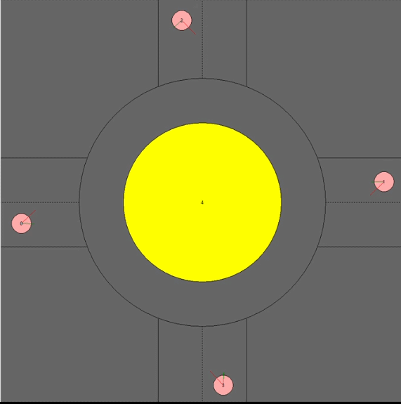

# Autonomous-Round-About-Navigation
Autonomous motion planning in a roundabout scenario using a forced based approach with parametric equations

Owners: Huzefa Dossaji, Sanket Bachuwar, Ardashir Bulsara Motion Planning of a Vehicle in a Roundabout Scenario

The objective was achieved using the method of waypoints and forced based local navigation. Bezier curves were used to generate the waypoints and trajectory for the agents to enter and exit the roundabout as the entry and exit lanes designed were single lanes. While forced based navigation was used inside the roundabout, as it consisted of two lanes. This allowed multiple agents to navigate the roundabout at the same time without colliding with each other.

This repositiory contains the simulator.py which runs the canvas simulation and agent.py file which contains definitions and functions of agent behavior of a roundabout scenerio simulation. This repositiory also contains agent csv file (crossing_agents, 3_agents, 8_agents) which has starting information for the agent on the roundabout with additional test python files. This repositiory also contains a final report in pdf form.

To run: ~: python simulator.py

